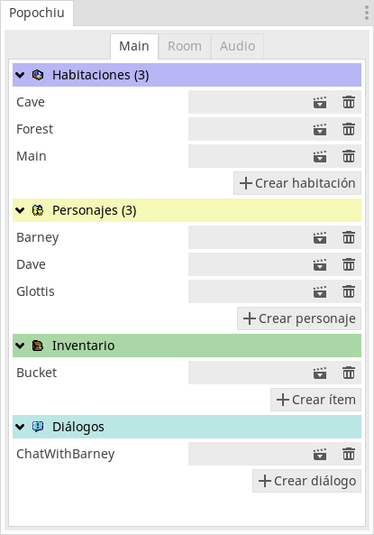

<!-- no toc -->
Framework para crear juegos de aventura con Godot al estilo de [Adventure Game Studio](https://www.adventuregamestudio.co.uk/) y [Power Quest](https://powerhoof.itch.io/powerquest).




- [📃 Características](#-características)


# 📃 Características

- Facilita la creación de habitaciones, personajes, objetos de inventario y diálogos.
- Las habitaciones pueden tener objetos con interacción (props), zonas con interacción (hotspots), áreas que disparan eventos (region), puntos a los que pueden moverse los personajes (points) y áreas transitables.
- Se pueden encadenar instrucciones fácilmente usando la función E.run([...]):
  ```gdscript
  func _on_room_transition_ended() -> void:
    E.run([
      'Player: Hola',
      'Paco: Hola',
      'Player: ¿Esto es una isla?',
      'Paco: No. Un juego de aventura.',
      C.player.face_right(),
      C.player.face_left(),
      '...',
      'Player: Ah bueno.',
    ])
  ```
- Acceso rápido a las funciones de control del núcleo (E), personajes (C), inventario (I), diálogos (D), interfaz gráfica (G)
  **C (para acceder a ICharacter.gd (singleton))**
    ```gdscript
    # El personaje controlado por el jugador dice Hola
    C.player.say('Hola')
    # Un personaje llamado Barney se pone grosero
    C.character_say('Barney', '¡Cállese maricón!')
    # El personaje controlado por el jugador se pone grosero también
    C.player_say('Qué malparido tan grosero')
    ```
  **I (para acceder a IInventory.gd (singleton))**
    ```gdscript
    # Añade el ítem Bucket al inventario
    I.add_item('Bucket')
    # Añade el ítem Bucket al inventario y lo hace, automáticamente, el ítem activo
    I.add_item_as_active('Bucket')
    ```
  **D (para acceder a IDialogTree.gd (singleton))**
    ```gdscript
      func on_interact() -> void:
	      yield(D.show_dialog('ChatWithBarney'), 'completed')
    ```
  **G (para acceder a IGraphicInterface.gd (singleton))**
    ```gdscript
    # Muestra un mensaje centrado, como una notificación.
    G.display('Usa clic izquierdo para interactuar y clic derecho para examinar')
    # En la parte inferior de la pantalla se puede ver el nombre del objeto sobre el que está el cursor
    G.show_info('Llave')
    ```
  **E (para acceder a Popochiu.gd (singleton))**
    ```gdscript
    E.run([
      'Barney: Hola... maricón',
      'Coco: No existo, entonces no puedo decir ni mierda',
      'Player: No tiene que tratarme tan feo...',
      E.wait(2),
      'Player: Malparido...',
      G.display('En un futuro se podrá hacer controlable cualquier personaje')
    ], 'completed')
    ```